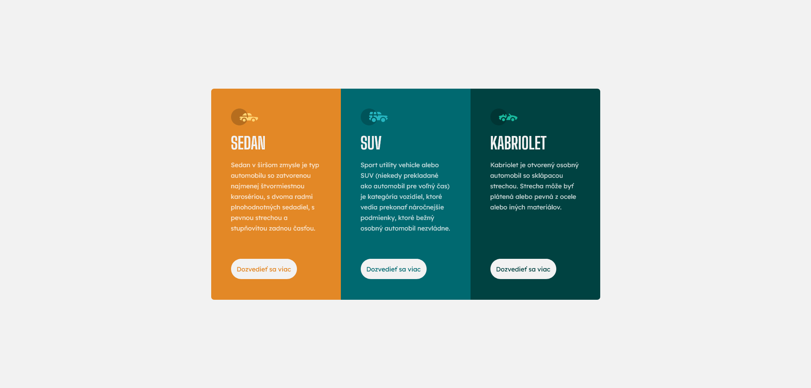
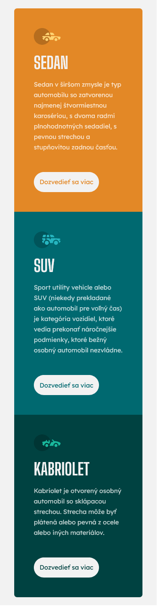

# Frontend Mentor - 3-column preview card component solution

## Informácie o projekte

Tento projekt je zo stránky Frontend Mentor ([3-column preview card component challenge on Frontend Mentor](https://www.frontendmentor.io/challenges/3column-preview-card-component-pH92eAR2-)). Projekty zo stránky Frontend Mentor pomáhajú zlepošovať "coding skills" na realistických projektoch. Predlohy projektov sú dostupné na Figme. Anglické texty som upravil na slovenské.

## Vytvorenie projektu

Projekt som vytvoril za dve hodiny. Použil som HTML a CSS. Ak mám spomenúť niečo, s čím som mal viac práce, tak to bolo zarovnávanie jednotlivých elementov.

#### [Odkaz na stránku s projektom](https://tomasdunik.github.io/frontend-mentor-newbie-3-column-preview-card-component/)

## Screenshots

### Desktop

### Mobile

## Odkazy

- Konkrétny projekt na Frontend Mentor: https://www.frontendmentor.io/solutions/3column-preview-card-component-n_8y2p3C45
- Moje ostatné projekty na Frontend Mentor: https://www.frontendmentor.io/profile/WeekendsProgrammer
